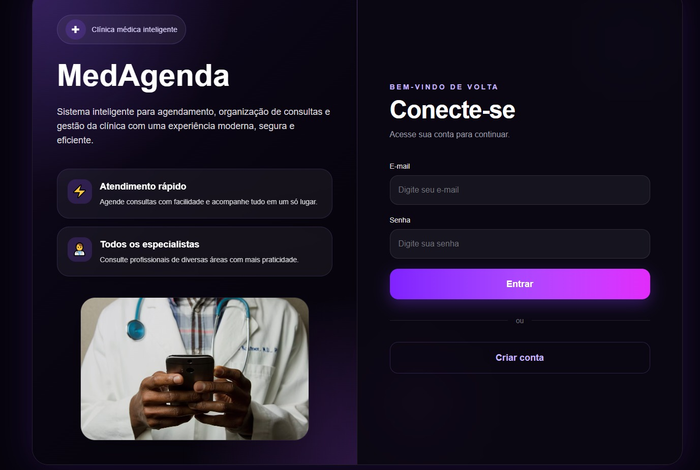
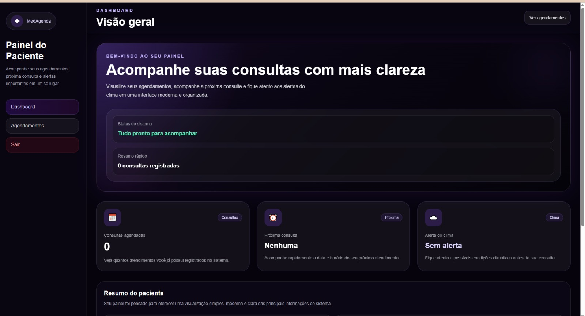
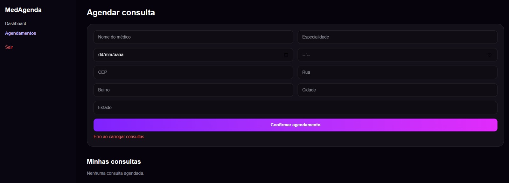

# 🏥 MedAgenda

Sistema inteligente para agendamento de consultas médicas.

## 🚀 Tecnologias
- Vue.js
- TypeScript
- Tailwind CSS
- Node.js
- Express

## ✨ Funcionalidades
- Login e cadastro
- Agendamento de consultas
- Dashboard do paciente
- Integração com CEP
- Alerta de clima
  
## 📸 Preview

### Login

### Dashboard

### Agendamentos

